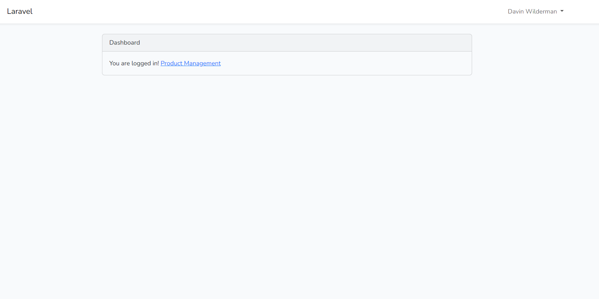

## Laravel 9 CRUD System with Authentication

This is a simple Laravel 8 project implementing a basic CRUD (Create, Read, Update, Delete) system for products with user authentication. The project uses Laravel UI with Bootstrap for authentication views and includes factories and seeders for both products and users. This project is designed for personal development and experimentation.

## Getting Started
 **Clone the Repository:** 

    git clone https://github.com/Gv3N/Laravel_CRUD.git 

    cd Laravel_CRUD

**Install Dependencies:** 

    composer require laravel/ui

    php artisan ui bootstrap --auth

**Configure Database:** 
Update the database connection details in the `.env` file.

**Run Migrations and Seeders** 
Modify the factory and seeder according your needs. 

    php artisan migrate --seed 

**Run the Development Server:**

    php artisan serve

Run the project based on your environment setup.

## Features

-   **Authentication:** Laravel UI with Bootstrap is integrated for user authentication.
    
-   **Product CRUD:** Create, Read, Update, and Delete products with a simple user-friendly interface.
    
-   **Database Seeder:** Seed the database with sample data using factories.

## Images
- Homepage
  
- Product Index
  
- Product Create
  
- Product Show
  
- Product Edit
  

## Usage

1.  **User Authentication:**
    -   Register a new account or login with the provided seeder user.
2.  **Product CRUD:**
    -   Access the product management section after login to perform CRUD operations on products.

## Customization

Feel free to customize and experiment with different features or add new functionality. Explore [Laravel documentation](https://laravel.com/docs/10.x/readme) for additional features and best practices.

## Contributing

Contributions are welcome! If you find any issues or have suggestions for improvements, please create an issue or submit a pull request. Please note that my schedule is currently busy, so it may take some time for me to review and respond to contributions. Your patience is greatly appreciated.

